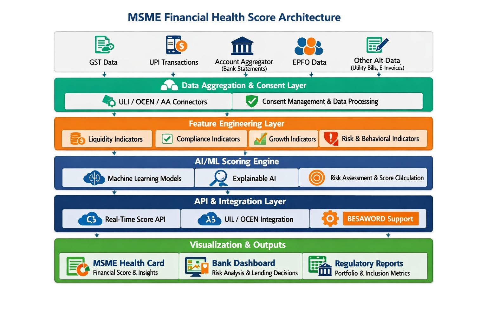
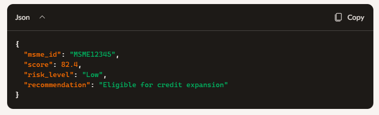

# MSME Financial Health Score Engine

A cloud‑native AI/ML solution that computes MSME financial health scores using alternate data sources (GST, UPI, EPFO, Account Aggregator).  
Built with **FastAPI**, **LightGBM/XGBoost**, and deployed on **Google Cloud Run** with CI/CD via **GitHub Actions**.

---

## 🚀 Overview

This project enables banks to assess MSME creditworthiness using explainable AI models trained on multidimensional financial indicators.  
It supports real‑time scoring, dashboard visualization, and integration with OCEN/AA frameworks.

---


## 🧩 Architecture



- **Model:** LightGBM / XGBoost classifier  
- **API Layer:** FastAPI REST endpoint `/score`  
- **Deployment:** Docker + Cloud Run  
- **CI/CD:** GitHub Actions → Cloud Build → Cloud Run  
- **Monitoring:** Cloud Logging & Cloud Monitoring

---

## 🛠️ Setup Instructions

###  1. Clone Repository
```bash
git clone https://github.com/krishnaraddi/msme-finhealth-score.git
cd msme-finhealth-score

---

## 🛠️ Cloud Run Deployment
    - Authenticate & Configure
    - Build & Deploy

### CI/CD Workflow
    - GitHub Actions (.github/workflows/deploy.yml)

##  Monitoring & Maintenance

    - Cloud Logging: Track API requests and errors.

    - Cloud Monitoring: Observe latency, throughput, and uptime.

    - Retraining: Schedule periodic model updates via Vertex AI or Cloud Scheduler.

##  Example Output



## 🧠 Future Enhancements
- Sector‑specific scoring models (Manufacturing, Services, Agriculture MSMEs)
- Behavioral nudges and gamified MSME dashboards
- Integration with IDBI sandbox and OCEN APIs
- Automated retraining pipeline using Vertex AI
- Multi‑language support for MSME dashboards

---

## 🏁 License
This project is licensed under the **Apache 2.0 License**.  
You are free to use, modify, and distribute this software with proper attribution.  
See the [LICENSE](LICENSE) file for details.

---

## 👤 Author
**Krishnaraddi V Kittur**
Founder & Technical Architect – Agentic AI Platforms 
https://www.dotcorps.com 
https://www.linkedin.com/in/krishnaraddi/
📍 Bengaluru, India  
